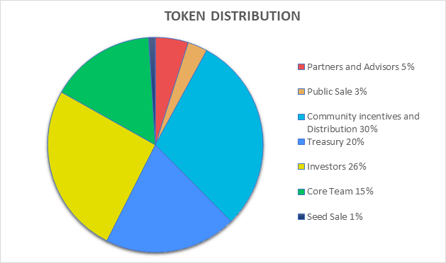

# Tokenomics

## Token Supply

* The token total supply is 1,500,000,000

## Token Distribution

* Partners and Advisors: 5% (75,000,000)
* Public Sale: 3% (45,000,000)
* Community incentives and Distribution: 30% (450,000,000)
* Treasury: 20% (300,000,000)
* Investors: 26% (390,000,000)
* Seed Sale: 1% (15,000,000)
* Core Team: 15% (225,000,000)

## Token Allocation

| Stage | Vesting Period |
| --- | --- |
| Investors | 20% to be released on TGE. After a two month cliff, 80% will be  released over 6 months on a monthly basis at a monthly linear rate. |
| Public Sale | 100% to be released on TGE. |
| Treasury | After a 6 month Cliff, 100% will be released over 42 months on a monthly basis at a monthly linear rate. |
| Community incentives and Distribution | After a 6 month Cliff, 100% will be released over 42 months on a monthly basis at a monthly linear rate. |
| Partners and Advisors | After a 3 month cliff, 100% will be released over 36 months on a monthly basis at a monthly linear rate. |
| Core Team | After a 12 months Cliff, 20% will be released, while the remaining 80% will be released over 42 months on a quarterly basis at a quarterly linear rate. |
| Seed Sale | 20% to be released on TGE. After a two month Cliff, 80% will be realeased over 6 months on a monthly basis at a monthly linear rate. |
